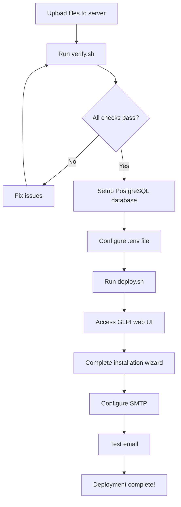

# GLPI Helpdesk Deployment Package

## 📋 Quick Start

1. **Upload to server**: `scp -r helpdesk/ root@194.163.146.126:/opt/apps/`
2. **SSH to server**: `ssh root@194.163.146.126 && cd /opt/apps/glpi`
3. **Verify prerequisites**: `chmod +x *.sh && ./verify.sh`
4. **Deploy**: `./deploy.sh`
5. **Access**: https://helpdesk.bluemoonit.com.au

## 📁 File Structure

```
helpdesk/
├── 📄 docker-compose.yml          # Docker Compose configuration
├── 📄 .env.example                # Environment template
├── 📄 .gitignore                  # Git ignore rules
├── 📄 setup-database.sql          # PostgreSQL setup script
│
├── 📖 Documentation
│   ├── README.md                  # Complete deployment guide
│   ├── SUMMARY.md                 # Project overview
│   ├── DEPLOYMENT-CHECKLIST.md    # Step-by-step checklist
│   ├── QUICK-REFERENCE.md         # Common commands
│   └── INDEX.md                   # This file
│
└── 🔧 Scripts
    ├── verify.sh                  # Pre-deployment verification
    ├── deploy.sh                  # Interactive deployment
    ├── backup.sh                  # Automated backup
    └── restore.sh                 # Restore from backup
```

## 📚 Documentation Guide

### For First-Time Deployment

1. **START HERE**: [SUMMARY.md](SUMMARY.md)
   - Project overview
   - Architecture diagram
   - Quick deployment steps

2. **THEN READ**: [README.md](README.md)
   - Detailed deployment instructions
   - Configuration guide
   - Troubleshooting

3. **USE THIS**: [DEPLOYMENT-CHECKLIST.md](DEPLOYMENT-CHECKLIST.md)
   - Step-by-step checklist
   - Verification steps
   - Success criteria

### For Daily Operations

1. **REFERENCE**: [QUICK-REFERENCE.md](QUICK-REFERENCE.md)
   - Common commands
   - Troubleshooting tips
   - Maintenance tasks

### For Specific Tasks

| Task | Document |
|------|----------|
| Initial deployment | README.md → Step 1-7 |
| Backup configuration | QUICK-REFERENCE.md → Backup & Restore |
| Troubleshooting | QUICK-REFERENCE.md → Troubleshooting |
| Migration | SUMMARY.md → Migration Guide |
| Security hardening | README.md → Step 7 |

## 🔧 Scripts Guide

### verify.sh - Pre-Deployment Verification

**Purpose**: Check all prerequisites before deployment

**Usage**:
```bash
chmod +x verify.sh
./verify.sh
```

**Checks**:
- ✅ Docker and Docker Compose installed
- ✅ Traefik running
- ✅ Proxy network exists
- ✅ PostgreSQL running
- ✅ DNS configured
- ✅ Ports available
- ✅ Disk space sufficient
- ✅ Required files present

**When to use**: Before first deployment or after server changes

---

### deploy.sh - Interactive Deployment

**Purpose**: Deploy GLPI with guided setup

**Usage**:
```bash
chmod +x deploy.sh
./deploy.sh
```

**What it does**:
1. Checks prerequisites
2. Creates/configures .env file
3. Prompts for database credentials
4. Prompts for Resend API key
5. Deploys GLPI container
6. Verifies deployment

**When to use**: First-time deployment or redeployment

---

### backup.sh - Automated Backup

**Purpose**: Backup GLPI volumes and database

**Usage**:
```bash
chmod +x backup.sh
./backup.sh
```

**What it backs up**:
- All Docker volumes (data, config, files, plugins)
- PostgreSQL database (complete dump)
- Backup manifest (metadata)

**Output**: `/opt/backups/glpi/glpi_*_YYYYMMDD_HHMMSS.*`

**When to use**: 
- Before updates
- Daily (via cron)
- Before major changes

**Cron setup**:
```bash
# Daily at 2 AM
0 2 * * * cd /opt/apps/glpi && ./backup.sh >> /var/log/glpi-backup.log 2>&1
```

---

### restore.sh - Restore from Backup

**Purpose**: Restore GLPI from backup

**Usage**:
```bash
chmod +x restore.sh
./restore.sh YYYYMMDD_HHMMSS
```

**Example**:
```bash
# List available backups
ls -1 /opt/backups/glpi/ | grep glpi_volumes

# Restore from specific backup
./restore.sh 20260105_140000
```

**What it does**:
1. Stops GLPI container
2. Restores Docker volumes
3. Drops and recreates database
4. Restores database from backup
5. Starts GLPI container
6. Verifies restoration

**When to use**:
- After data corruption
- To rollback changes
- Migration to new server

## 🚀 Deployment Workflow

### First-Time Deployment



### Step-by-Step

1. **Pre-Deployment** (5 minutes)
   ```bash
   ./verify.sh
   ```

2. **Database Setup** (2 minutes)
   ```bash
   psql -U postgres -f setup-database.sql
   ```

3. **Environment Configuration** (3 minutes)
   ```bash
   cp .env.example .env
   nano .env  # Edit values
   ```

4. **Deployment** (5 minutes)
   ```bash
   ./deploy.sh
   ```

5. **Web Configuration** (10 minutes)
   - Access https://helpdesk.bluemoonit.com.au
   - Complete installation wizard
   - Change default passwords

6. **SMTP Configuration** (5 minutes)
   - Setup → General → Notifications
   - Configure Resend SMTP
   - Send test email

**Total Time**: ~30 minutes

## 🔐 Security Checklist

Before going live:

- [ ] Change all default passwords
- [ ] Disable unused accounts (tech, normal, post-only)
- [ ] Configure strong password policy
- [ ] Verify HTTPS is working (no certificate warnings)
- [ ] Test email functionality
- [ ] Set up automated backups
- [ ] Document credentials in password manager
- [ ] Review user permissions
- [ ] Enable audit logging
- [ ] Configure session timeout

## 🛠️ Maintenance Schedule

### Daily
- [ ] Check logs for errors: `docker compose logs glpi | grep -i error`
- [ ] Verify backup completed: `ls -lh /opt/backups/glpi/`
- [ ] Monitor disk space: `df -h`

### Weekly
- [ ] Review open tickets in GLPI
- [ ] Check email delivery (Resend dashboard)
- [ ] Review security logs
- [ ] Check for GLPI updates

### Monthly
- [ ] Test backup restoration
- [ ] Database optimization: `VACUUM ANALYZE`
- [ ] Review user accounts
- [ ] Update GLPI to latest version
- [ ] Review and update documentation

## 🆘 Emergency Contacts

### System Issues
- **Docker**: Check Docker daemon status
- **Traefik**: Check reverse proxy logs
- **PostgreSQL**: Check database logs
- **Network**: Check DNS and firewall

### Quick Fixes

| Issue | Quick Fix |
|-------|-----------|
| GLPI not accessible | `docker compose restart glpi` |
| Database connection error | Check PostgreSQL status, verify credentials |
| Email not sending | Verify Resend API key, check SMTP config |
| Certificate error | Check Traefik logs, verify DNS |
| Slow performance | Check disk space, restart container |

## 📊 Monitoring

### Key Metrics to Monitor

1. **Container Health**
   ```bash
   docker compose ps
   docker stats glpi
   ```

2. **Disk Usage**
   ```bash
   df -h
   docker system df
   ```

3. **Database Size**
   ```bash
   docker exec postgres psql -U glpi_user -d glpi -c "SELECT pg_size_pretty(pg_database_size('glpi'));"
   ```

4. **Logs**
   ```bash
   docker compose logs --tail=100 glpi
   ```

5. **Email Delivery**
   - Check Resend dashboard: https://resend.com/emails

## 🔄 Update Procedure

### Minor Updates (Patch Versions)

```bash
# Backup first
./backup.sh

# Pull latest image
docker compose pull

# Recreate container
docker compose up -d

# Verify
docker compose logs -f glpi
```

### Major Updates (Version Upgrades)

1. **Backup everything**
   ```bash
   ./backup.sh
   ```

2. **Read release notes**
   - Check GLPI changelog
   - Note breaking changes

3. **Test in staging** (if available)

4. **Update production**
   ```bash
   docker compose pull
   docker compose up -d
   ```

5. **Verify**
   - Test login
   - Check database
   - Send test email
   - Review logs

6. **Rollback if needed**
   ```bash
   ./restore.sh <backup_date>
   ```

## 📞 Support Resources

### Documentation
- **This Package**: See files in this directory
- **GLPI Official**: https://glpi-project.org/documentation/
- **GLPI Forums**: https://forum.glpi-project.org/

### External Services
- **Resend**: https://resend.com/docs
- **Traefik**: https://doc.traefik.io/traefik/
- **Docker**: https://docs.docker.com/

### Community
- **GLPI GitHub**: https://github.com/glpi-project/glpi
- **GLPI Discord**: https://discord.gg/glpi

## 📝 Notes

### Design Decisions

1. **PostgreSQL on Host**: Uses existing PostgreSQL instead of containerized version
2. **Traefik Integration**: No direct internet exposure, HTTPS handled by Traefik
3. **Resend SMTP**: Branded email from support@bluemoonit.com.au
4. **Separate from bluemoonsite**: Independent stack for easy migration
5. **No plugins**: Minimal installation as per requirements

### Future Enhancements

- [ ] IMAP integration for email piping
- [ ] LDAP/Active Directory integration
- [ ] Custom plugins (if needed)
- [ ] Monitoring integration (Prometheus/Grafana)
- [ ] Automated testing
- [ ] Staging environment

### Known Limitations

- IMAP not configured (outbound SMTP only)
- No plugins installed by default
- Manual SMTP configuration required (not automated)

## ✅ Deployment Checklist

Use this quick checklist for deployment:

- [ ] Files uploaded to `/opt/apps/glpi`
- [ ] Run `./verify.sh` - all checks pass
- [ ] PostgreSQL database created
- [ ] `.env` file configured
- [ ] Run `./deploy.sh` - deployment successful
- [ ] GLPI accessible at https://helpdesk.bluemoonit.com.au
- [ ] Installation wizard completed
- [ ] Default passwords changed
- [ ] SMTP configured and tested
- [ ] Backup script tested
- [ ] Documentation reviewed

## 🎯 Success Criteria

Deployment is successful when:

✅ GLPI accessible at https://helpdesk.bluemoonit.com.au  
✅ HTTPS certificate valid (no warnings)  
✅ Can log in with admin account  
✅ Database connection working  
✅ Test email sends successfully  
✅ No errors in logs  
✅ Can create and view tickets  
✅ Backups working  

---

**Version**: 1.0  
**Created**: 2026-01-05  
**Status**: Ready for deployment  
**Maintainer**: System Administrator  

For questions or issues, refer to the documentation files in this package.
